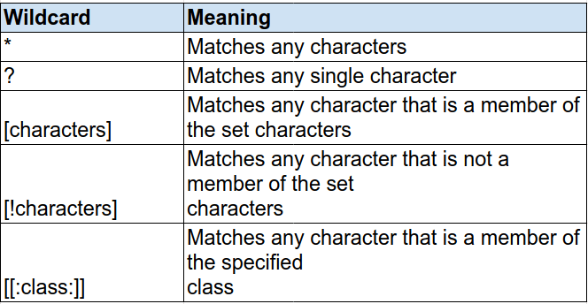

<!-- @format -->

# Ubuntu Installation and Disk Partition

### partition image

### After installation

### Please make sure display font size and setting appearance make it up to you

### And if you install chrome then please make sure you sue **GTK** Them for better UI & UX

### some linux wildcards

### ls document\_\* , ls \*.txt

     ls file.?.csv

     cat files/*.csv

     cp files/* .

     rm *.csv

     rm document_*

     touch file_10.txt

     rm file_?.txt

     ls -l *.xml

### Important tool for networking

     sudo apt install net-tools

### Holding "Backspace" deletes only one character

     gsettings set org.gnome.desktop.peripherals.keyboard repeat true

### Font size increase

     sudo apt install gnome-tweaks

### For update system

     sudo apt-get update

# SSH Key Agent Setup

### Generating ssh key

     ssh-keygen -t ed25519 -C test@gmail.com

### Set ssh key in ssh-agent

     eval "$(ssh-agent -s)"

## Make ssh config file for store our .peb file or private key

     touch ~/.ssh/config

### Open the file

     nano ~/.ssh/config

### Writing the following value

     Host *
     AddKeysToAgent yes
     IdentityFile ~/.ssh/id_ed25519

### Add into SHH

     ssh-add ~/.ssh/id_ed25519

### Copy the public key

     cat ~/.ssh/id_ed25519.pub

### check your SSH connection

     ssh -T git@github.com

     ssh -T git@gitlab.com

     ssh -T git@bitbucket.org

# Install multi-media code & VLC Player

     sudo apt install ubuntu-restricted-extras && sudo apt install vlc

### unzip file

     unzip /path/to/file.zip -d temp_for_zip_extract

## Enable minimise on click

     gsettings set org.gnome.shell.extensions.dash-to-dock click-action "minimize"

## Enable Firewall

     sudo systemctl status ufw

     sudo systemctl enable ufw

     sudo ufw enable

     sudo ufw disable

     sudo ufw status

     sudo ufw allow 22/tcp

     sudo ufw deny 22/tcp

## Use FlatPak Instead of Snap

     sudo apt install flatpak

### flatpak.org search in brower

- Please make sure first add flat repository
- Also add flatpak plugin
- after restart pc

### Speed up app launch time Preload

     sudo apt install preload

# Live Patch

     uname -ar
     uname -a

- You have to create Ubuntu account use this future
- Free to use up to 30 machines
- Go to software update and active live patch
- Token you get from UBuntu website

### If you want you use keboard shortcuts please. Go setting inside keyboard shortcuts and set as you need

## If you need system backup

- then use timeshift tool

## Use Windows app

- Then use the Bottles tool
- Or you can use wine for small app like lighshot tools

## If you use Ubuntu then you lapto bettery very fast decrease the charge then you should try this app instad

` sudo apt install tlp tlp-rdw`

`sudo systemctl enable tlp`

` sudo systemctl start tlp`

## clean you junk file

     sudo apt install bleachbit

### get list of drive

     df

### linux disk fragment ext4

`sudo e4defrag -c /`

`man e4defrag `

`df`

`which df`

`df -hT`

`df -Th | sort`

`sudo e4defrag -c /dev/sda3`

`sudo e4defrag -c /`

`sudo e4defrag /`

`pkm-own e4defrag`

`pkm-search e2fsprogs`

### clean up script

[clean up script](https://github.com/hamzazahidulislam/Ubuntu-Cleanup-Script/blob/master/clean.sh)

[clean up script](./scripts/clean.sh)

### how to run this code

- give executable permission linux file

  `chmod +x ./clean.sh`

  `chmod 700 ./clean.sh`

  `sudo ./clean.sh`

# Change grub time to 3 to 4 second or 0

`sudo nano /etc/default/grub
`

`sudo update-grub
`

# Ubuntu update scrpt

[script ](https://github.com/hamzazahidulislam/ubuntu-update.sh)

# Update those application you download from snap or flatpak

- first update and upgrade your system

  `sudo apt install google-chrome-stable`

- if your uninstable version then remove it by this command

  `sudo apt install google-chrome-unstable`

- if you want to join beta version instead use this

  `sudo apt install google-chrome-beta`

- install firefox

  `sudo snap install firefox`

- update firefox

  ` sudo snap refresh firefox`

- uninstall

  `sudo snap remove firefox`

# Flatpak application update

`sudo flatpak update`

- If, instead, you would like to update an individual application, you can supply the --app argument and specify which application you want to update. For example, this command would update the GIMP package downloaded from FlatHub:

`sudo flatpak update --app org.gimp.GIMP`

`flatpak update package_name`

`flatpak update org.telegram.desktop`

- # please make sure you add a name from flathub.org if you mistake in the name then the package couldn't be found in the repository

# Common Error

- Can't refresh snap-store

  `ps -e | grep snap-store #id blocking process`
  `kill #id`
  `sudo snap refresh`

# [Install Linux Wine HQ + CCleaner on Ubuntu 9.10 ](https://youtu.be/bnNL4eJeV_s)

# [How can I hover over icons in Ubuntu Dock to see all windows of one application?](https://askubuntu.com/questions/1026442/how-can-i-hover-over-icons-in-ubuntu-dock-to-see-all-windows-of-one-application)

- `gsettings set org.gnome.shell.extensions.dash-to-dock click-action 'previews'`

# [How do I open all windows when clicking the icon in Ubuntu dock?](https://askubuntu.com/questions/1016792/how-do-i-open-all-windows-when-clicking-the-icon-in-ubuntu-dock)

- `gsettings set org.gnome.shell.extensions.dash-to-dock click-action 'minimize'`

# [How can I specify the default save directory for gnome-screenshot?](https://askubuntu.com/questions/114429/how-can-i-specify-the-default-save-directory-for-gnome-screenshot)

- ### ` gsettings set org.gnome.gnome-screenshot auto-save-directory "file:///home/$USER/Downloads/"`

# Installing and using vnStat and vnStati for Monitoring Network Traffic in Ubuntu

### monitor your network traffic

### 2 Installing vnStat and vnStati

     sudo apt-get install vnstat
     sudo apt-get install vnstati

! [source](https://www.howtoforge.com/tutorial/vnstat-network-monitoring-ubuntu/)

### check your network interface

## 3 vnStat setup and running

- Once the installation is complete, vnStat has to be set up or configured as it does not start on its own. vnStat has to be told explicitly which interfaces have to be monitored. We then start the vnStat daemon called "vnstatd", which starts vnStat and monitors for as long as it is not stopped explicitly.

- Before we start configuring vnstat, use ifconfig to get the name of the network interface that we want to monitor.

`     ifconfig`

https://www.cyberciti.biz/faq/ubuntu-install-vnstat-console-network-traffic-monitor/

     sudo systemctl restart vnstat.service
     sudo systemctl start vnstat.service
     sudo systemctl reload vnstat.service

### you customize your script as cron job

     -  nano /etc/systemd/system/multi-user.target.wants/vnstat.service

## check you your network traffic

      vnstat -i wlo1

## you see gui

     vnstati -s -i wlo1 -o ~/summary.png

## you can check the status of service that are runing

     sudo systemctl status vnstat.service

## If you want to setup hibernate for ubuntu

[Watch this video on youtube](https://youtu.be/wngBplRkm5o?si=Q_dVZfCrnvHU0bmh)

## "wind+a" you get multiple active window in your ubuntu

## Screenshot shortcut hot keey "Fn+alt+PrtSc" please check maybe this is very system to system

## If you want to shae your local file in your local network using samba

     sudo apt-get install samba samba-common-bin
     sudo smbpasswd -a $USER
     sudo nano /etc/samba/smb.conf

## [Please follow this ubuntu doc ](https://ubuntu.com/tutorials/install-and-configure-samba#3-setting-up-samba)

## If you update samba config fil then restart samba service

     sudo systemctl restart samba
     sudo systemctl daemon-reload

## [How install screenrecorder on ubuntu](https://www.geeksforgeeks.org/how-to-install-simplescreenrecorder-ubuntu/)

## If you face any error when use simplescreenrecorder then Watch this video on youtube [Click me](https://www.youtube.com/watch?v=TlxUvs2rv80)

## If you have to switch your speker use this tool

     sudo apt-get install alsa-tools-gui

## For Ubuntu reference [How to switch between headphones and speakers without unplugging headphones](https://askubuntu.com/questions/712517/how-to-switch-between-headphones-and-speakers-without-unplugging-headphones)

## shortcut for video editing tool

## desktop shortcut in ubuntu [How to make a desktop shortcut on Ubuntu 20.04?](https://askubuntu.com/questions/1232612/how-to-make-a-desktop-shortcut-on-ubuntu-20-04)

## [Is there a shortcut key for file browser? (Equiv. of Win+E)](https://superuser.com/questions/139959/is-there-a-shortcut-key-for-file-browser-equiv-of-wine)

## set manual schedule for night light from 00:00 to 00:00

# Linux important commands

## delete branch locally

`git branch -d localBranchName`

## delete local branch that is unmerged

`git branch -D localBranchName`

## delete branch remotely

`git push origin --delete remoteBranchName`

`git push --delete remoteName branchName`

`git branch --show-current`

` git checkout -b <new branch>`

## Remove all files except one directory linux

`rm -rf !(".git" | "abc.log" ) `

## linux copy file to another directory except one file

`cp -v "documents/* !(*important_doc.txt*)" "backup"
`

## Linux desktop file shortcut

- $PWD means which directory you want to shortcut in your desktop

` ln -s $PWD ~/Desktop/`

## cp -r without hidden files [ref](https://stackoverflow.com/questions/11557114/cp-r-without-hidden-files)

## Stop or kill running service

- # example i kill gnome-clocks

`sudo pkill gnome-clocks`

`rsync -av --exclude=".*" src dest`

## How to zip file in linux command

`zip --password 123 data.zip myfile`

- Recursive

  `zip --password 123 data.zip myfile -r ./`

## How to install LaTex

- ## [First install distribution](https://miktex.org/download)

- ## [Next install texstudio](https://www.texstudio.org/#download)

- ## Furthermore, an app-image is available which can be run on any platform: _appImage_ (). Just make the file executable and run it.

`sudo apt-get install gedit`

`cd ~/.local/share/applications/`

`gedit texstudio.desktop`

`[Desktop Entry]
Version=1.0
Type=Application
Terminal=false
Name=TeXstudio
Icon[en_US]=/home/user/Desktop/texstudio/texstudio128x128.png
Exec=/home/user/Desktop/texstudio/texstudio-4.8.7-x86_64.AppImage`

`ls -a | grep texstudio.desktop`

`sudo chmod +x texstudio.desktop `

`sudo update-desktop-database ~/.local/share/applications/
`
